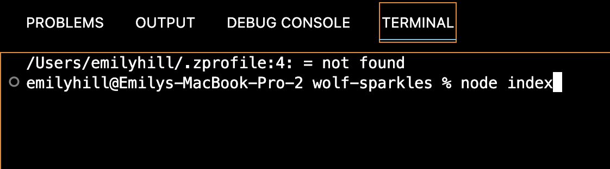
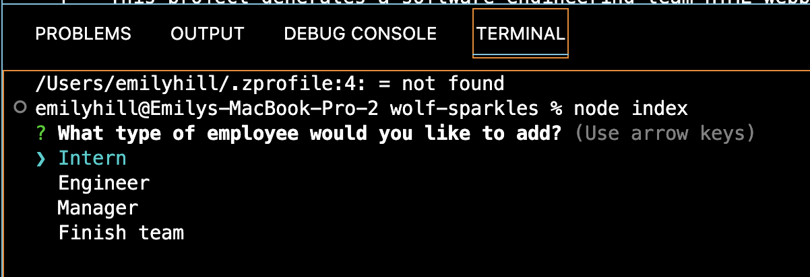
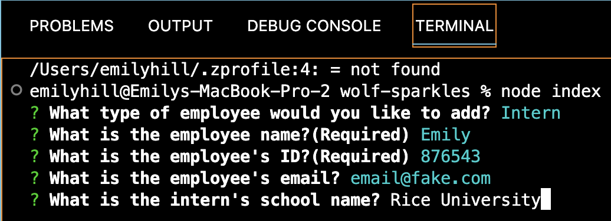
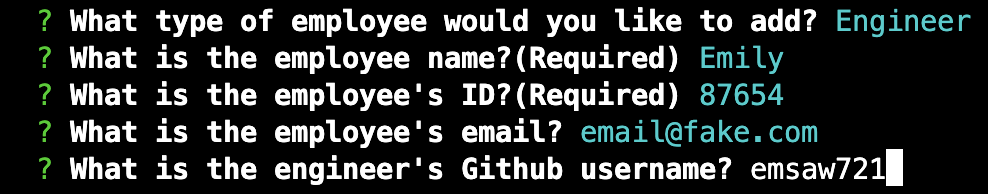
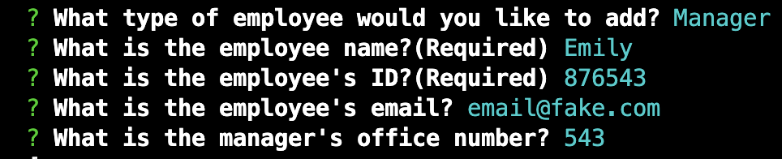
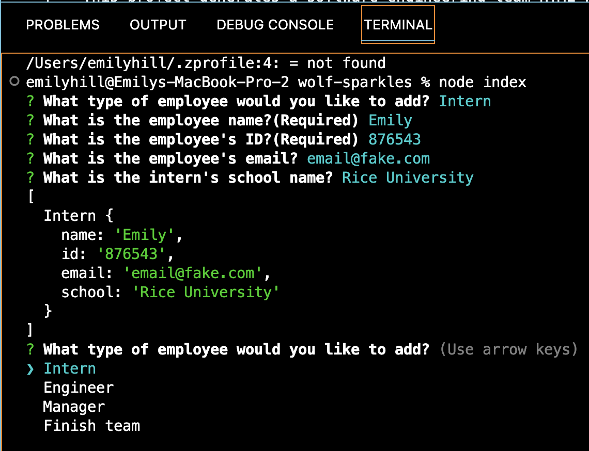
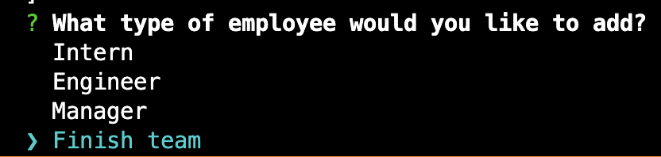
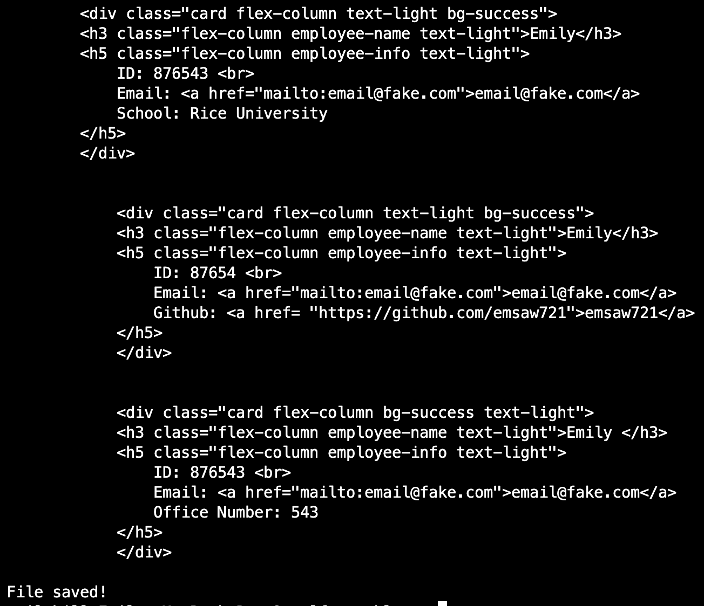
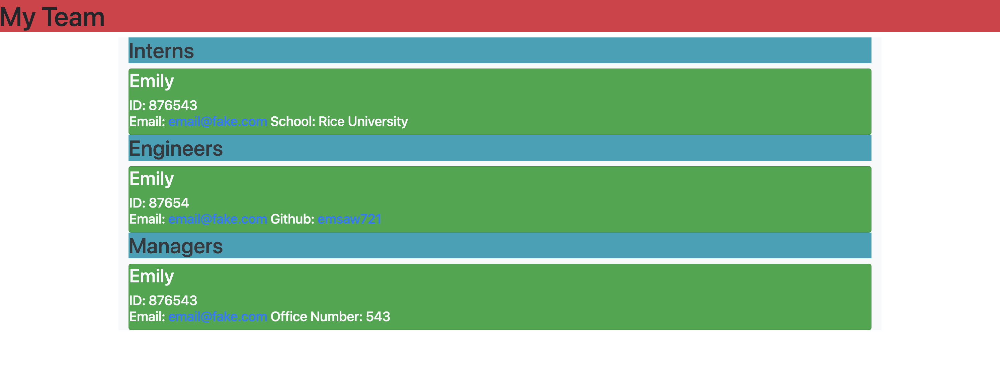
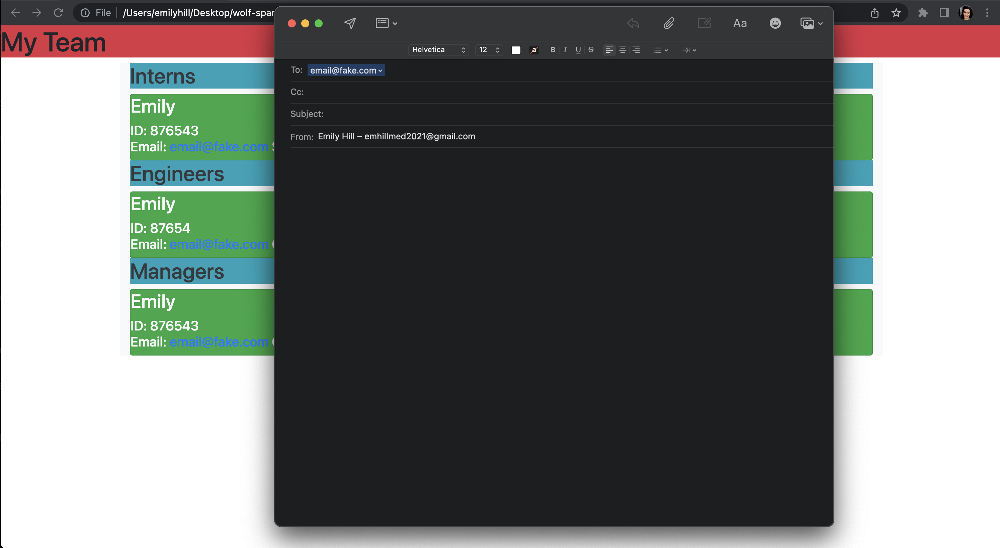

# wolf-sparkles

## Description 
This project generates a software engineering team HTML webpage using Node.js. 
https://drive.google.com/file/d/1iy0Xkv2ikgRupUbySP6NILiLO35rycrm/view

## Table of Contents 
[Installation](#installation)
[Usage](#usage)
[Credits](#credits)
[Tests](#tests)
[Questions](#questions)
[License](#license)

## Installation 
In order to run this application, the user must install the <a href="https://www.npmjs.com/package/inquirer">Inquirer</a>package and the <a href="https://www.npmjs.com/package/jest">Jest</a> package in order to collect user input and run a suit of tests, respectively. 

## Usage 
First, the user will invoke the application using node index. 

After, the user will select the type of employee that they would like to add.

Once the user has selected the employee type, questions for each employee (name, id, email) will be asked as well as a special question pertaining to the certain type of employee. For interns, the question is school name:

For engineers, it is their GitHub username that will generate a link to the GitHub page:

And for managers, it is their office number: 

After the user is finished with the first employee, the employee type prompt will reappear so the user can enter a new employee.

If the user is finished building their team, the user can select the "Finished team" option.

This will prompt the generation of an index.html file with the team data displayed and will display a message indicating the data was saved. 

The finished generated webpage should look like the following image, complete with working email links and links to engineer's GitHub accounts. 

 

## Future Iterations 
Future iterations of this project will include fixed formatting of the h2 heading, a smaller card display for each employee, and a photo of each employee. 

## Credits 

## Tests
In order to run tests for this project, the user should type "npm test" into their terminal. 

## Questions 
If you have any questions, you can reach me at emsaw721 or fakeemail@fake.com. 

## How to Contribute 
Users wishing to contribute can contact me at my email fakeemail@fake.com. 

## License 
<a href='https://opensource.org/licenses/MIT/'>MIT</a> 